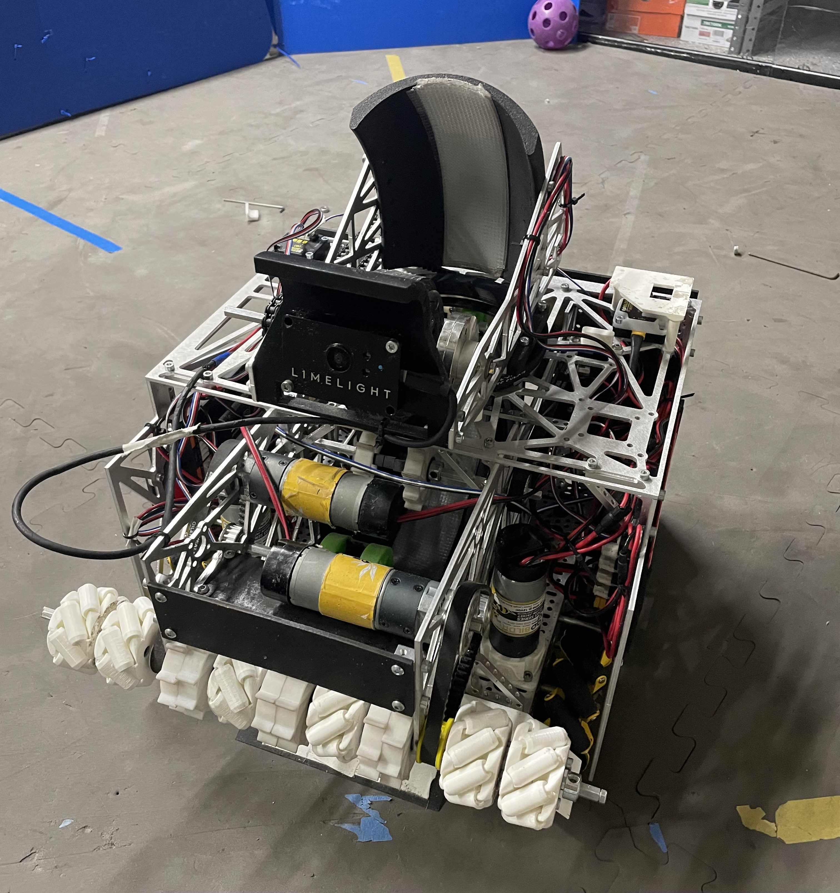
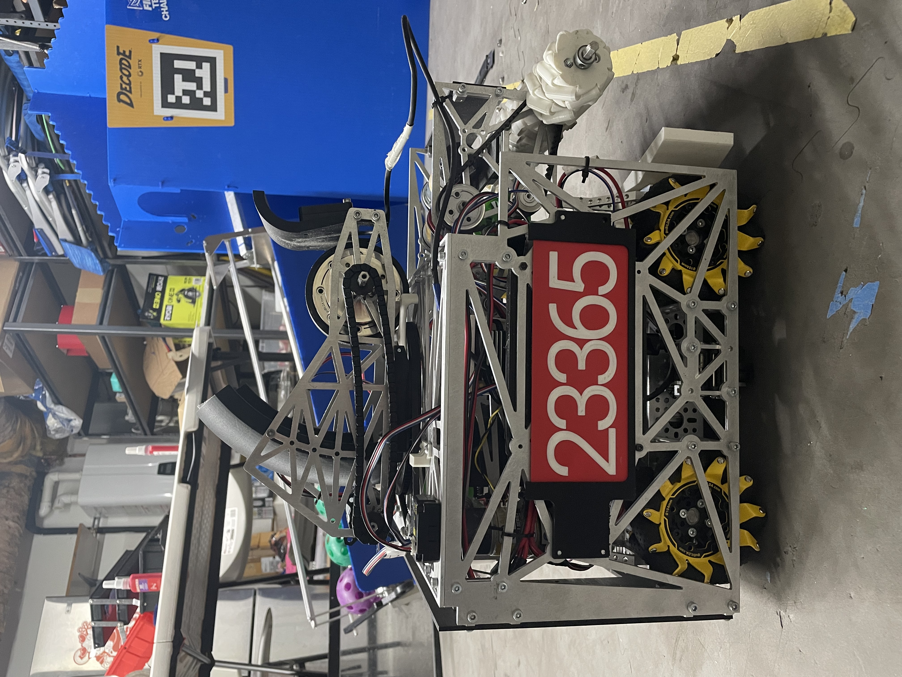
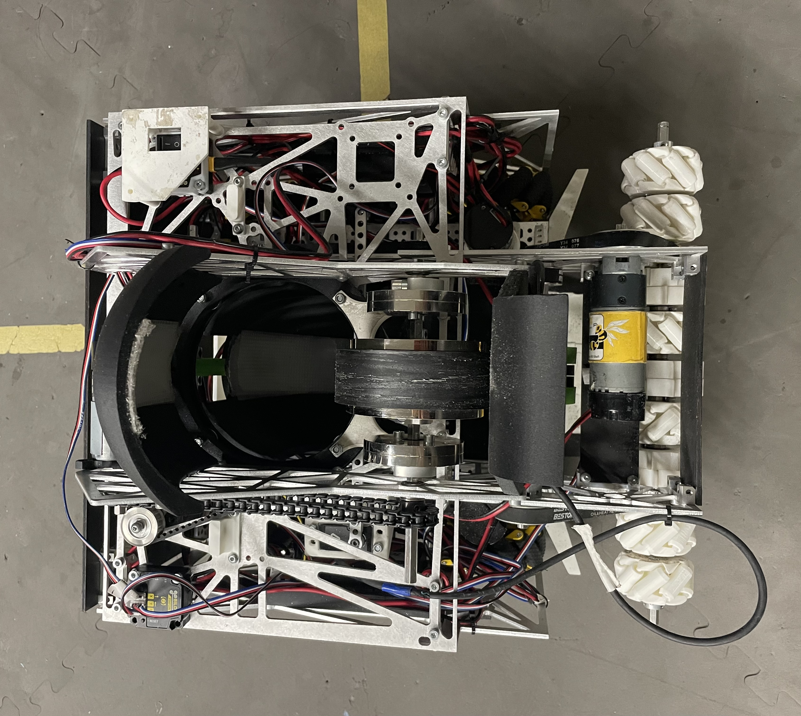
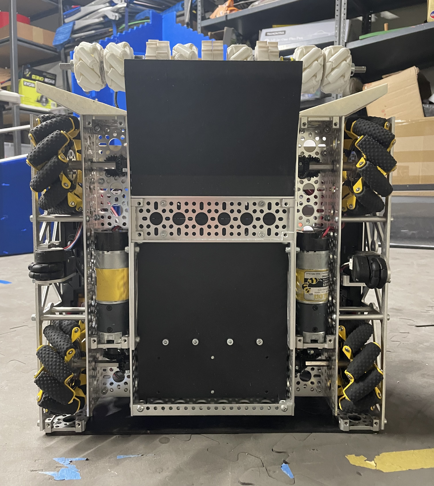

<div align="center">

# Omega

**Team 23365 — Alpha Robotics**

*FIRST Tech Challenge · DECODE 2025–2026 Season*


*A student-led FTC team focused on technical excellence, community impact, and long-term sustainability.*



</div>

---

## Table of Contents

- [About](#about)
- [The Team](#the-team)
- [Robot Design Evolution](#robot-design-evolution)
- [Robot Subsystems](#robot-subsystems)
- [Software Features](#software-features)
- [Competition Results](#competition-results)
- [Project Structure](#project-structure)
- [OpModes](#opmodes)
- [Controls](#controls)
- [Dependencies](#dependencies)
- [Getting Started](#getting-started)
- [Resources](#resources)
- [Outreach](#outreach)
- [Acknowledgments](#acknowledgments)

---

## About

Alpha Robotics is a **student-led** FTC team focused on technical excellence, community impact, and long-term sustainability. As a small team, each member contributes across hardware, software, outreach, and documentation, allowing us to work efficiently while developing well-rounded engineers.

**Omega** is our codebase for the DECODE (2025–2026) season, featuring autonomous path planning with Pedro Pathing, vision-based turret tracking with Limelight 3A, and a ballistic prediction system for accurate artifact launching across the full field.

<div align="center">


</div>

---

## The Team

| Member | Role |
|--------|------|
| **Zhaolong S.** | Coach & Mentor — Ph.D. in Mechanical Engineering (Boston University) |
| **Jason S.** | Team Captain & Software Lead |
| **John C.** | Design Lead |
| **Aric X.** | Documentation Lead, Outreach Director & Driver |
| **Andy S.** | Software Team |
| **Sophia L.** | Hardware Team & Outreach Mentor |

---

## Robot Design Evolution

Our team iterated through multiple robot designs this season, learning critical engineering lessons at each stage.

### Design 1 — Original (Oct–Nov 2025)

The first design featured a gear-turned center wheel sorting system, adjustable overhead flywheel shooter, and belt chain intake. While ambitious, it suffered from multiple mechanical failures at **Meet One (11/16/25)** — drivetrain friction, ball jams, gear slippage, and inconsistent ball transfer. After 2–3 shots the robot would break down.

> *Understanding the difficulty in this design and the time it would take, our team sparked a new idea.*

### Design 2 — Delta (Nov 2025)

During Thanksgiving break, every member sacrificed hours to rebuild from scratch. **Delta** was a simpler, faster robot focused on what matters: **intake and shooting efficiency**. The redesign eliminated many hardware challenges and operated at over **400% efficiency** compared to the first design.

### Design 3 — Delta Final (Jan 2026)

The final iteration (Version 3, completed 1/13/26) incorporated key improvements:
- **Aluminum plates** for the shooter (replacing earlier materials)
- **Gear chain system** replacing belts — faster flywheel acceleration and increased power
- **Side servo wheels** for wider intake coverage
- **High-inertia flywheel** — metal platings on the shaft for better velocity maintenance during consecutive shots
- **Wide belt intake** — two 1000 RPM motors powering the full intake system
- Can now **shoot from the furthest scoring zone** on the field

---

## Robot Subsystems

### Mecanum Drivetrain

<div align="center">

</div>

- 4-wheel holonomic mecanum drive
- **GoBilda Pinpoint** odometry localization
- Voltage-compensated motor output for consistent performance across battery states

### Turret (160° rotation)
- Motorized turret with ±65° rotation range (130° total coverage)
- **Limelight 3A** camera for real-time target tracking
- **Dual-mode operation:**
  - **Estimation Mode** — uses odometry-based robot position to calculate turret angle toward the goal
  - **Camera Adjust Mode** — after activating tracking, identifies AprilTags and fine-tunes the turret angle via PID control regardless of robot movement
- Multi-pipeline vision (color pattern detection for DECODE artifacts)

### Flywheel Shooter

<div align="center">

<br><em>Shooting sequence demonstration</em>
</div>

- High-inertia flywheel launcher with PIDF velocity control
- **Adaptive RPM calculation** — flywheel speed adjusts based on AprilTag size detected by Limelight:

  > *R<sub>pm</sub> ~ a / sqrt(TagSize) + b*
  > Reciprocal square-root regression model (R² = 0.9791)

- Gate servo for controlled firing
- Gear chain drive for rapid flywheel acceleration

### Belt Chain Intake
- Dual-motor (2x 1000 RPM) wide belt intake system
- Side servo guide wheels for artifact capture
- Distance sensor for artifact detection

### Status LEDs
| Color | Meaning |
|-------|---------|
| Green | Ready to shoot |
| Blue | At target RPM, turret still aligning |
| Red | Not ready |
| Orange | Turret at rotation limit |

---

## Software Features

- **Pedro Pathing v2.0.6** — Bezier curve and line-based autonomous path planning with smooth heading interpolation
- **Limelight 3A Vision** — AprilTag detection for turret auto-aim and RPM estimation
- **Ballistic Prediction** — Physics-based flywheel velocity calculation accounting for drag, gravity, launch angle, and robot motion during projectile flight
- **PID Control** — Multi-level PIDF controllers for flywheel velocity and turret rotation
- **Voltage Compensation** — Real-time battery monitoring with adaptive motor scaling
- **State Machine Autonomous** — Timer-driven state machine for reliable autonomous execution
- **Sequencer System** — Timed action sequences for shoot routines (gate → intake → fire → reset)
- **Low-Pass Filtering & Slew Rate Limiting** — Signal smoothing for accelerometer data and turret motion
- **FullPanels Telemetry** — Enhanced dashboard for real-time debugging

---

## Competition Results

### ILT Tournament — 01/24/26

| Metric | Result |
|--------|--------|
| **Placement** | 6th out of 31 teams |
| **Alliance** | 3rd Alliance Winner |
| **Control Award** | 1st Place |
| **Dean's List** | 2 Semi-finalists |
| **Autonomous** | Consistently averaged 36+ points |
| **TeleOp Accuracy** | ~90% shooting accuracy at near side |

### Performance Progression

| Meet | Avg. Artifacts Scored | Reliability |
|------|----------------------|-------------|
| Meet 1 (Design 1) | 2–5 per match | ~90% chance of hardware failure |
| Meet 2 (Delta) | 5–9 per match | ~90% shooting accuracy |
| Meet 3 (Delta Final) | 9+ per match | Consistent, no hardware/software issues |

---

## Project Structure

```
TeamCode/src/main/java/org/firstinspires/ftc/teamcode/
├── assemblies/          # Robot subsystem classes
│   ├── Robot.java       # Main robot class (drivetrain, localization, voltage comp)
│   ├── Shooter.java     # Flywheel, intake, gate, ballistic prediction
│   └── Turret.java      # Turret motor, Limelight vision, aim control
├── opModes/             # Competition OpModes
│   ├── autoBlue12C.java # Blue alliance, center start (12 artifact)
│   ├── autoBlue12F.java # Blue alliance, far start
│   ├── autoRed12C.java  # Red alliance, center start
│   ├── autoRed12F.java  # Red alliance, far start
│   ├── AutoPaths.java   # Path definitions and waypoints
│   ├── teleOpMainBlue.java
│   ├── teleOpMainBlueFar.java
│   ├── teleOpMainRed.java
│   ├── teleOpMainRedFar.java
│   ├── shooterPID.java  # Flywheel PID tuning utility
│   └── turretPID.java   # Turret PID tuning utility
├── pedroPathing/        # Pedro Pathing configuration
│   ├── Constants.java   # Motion constants, PIDF tuning, robot mass
│   └── Tuning.java      # Localization and path tuning utilities
└── util/                # Utility classes
    ├── PIDcontroller.java
    ├── SlewRateLimiter.java
    ├── LowPassFilter.java
    ├── Sequencer.java
    ├── ActionPress.java
    └── Assembly.java     # Abstract base class for subsystems
```

---

## OpModes

### Autonomous (4 variants)

Our main autonomous strategy starts from the close side, using a set turret angle and flywheel RPM to shoot at a fixed point while the robot navigates through artifact collection cycles.

**Autonomous Path:**
1. Shoot pre-loaded artifacts
2. Intake first row → reset gate → shoot
3. Intake second row → shoot
4. Intake third row → shoot
5. Park in the opposing team's parking square

In successful conditions, autonomous scores **36 points** (excluding pattern bonuses).

| OpMode | Alliance | Start Position | Strategy |
|--------|----------|----------------|----------|
| `autoBlue12C` | Blue | Center | 12 artifact collection cycle |
| `autoBlue12F` | Blue | Far | 12 artifact far-field |
| `autoRed12C` | Red | Center | Mirrors Blue center |
| `autoRed12F` | Red | Far | Mirrors Blue far |

### TeleOp (4 variants)

| OpMode | Alliance | Start Position |
|--------|----------|----------------|
| `teleOpMainBlue` | Blue | Standard (32, 72) |
| `teleOpMainBlueFar` | Blue | Far (36, 36) |
| `teleOpMainRed` | Red | Standard |
| `teleOpMainRedFar` | Red | Far |

### Tuning & Test Modes

| OpMode | Purpose |
|--------|---------|
| `shooterPID` | Real-time flywheel PIDF tuning |
| `turretPID` | Turret rotation testing |
| Pedro Pathing Tuning | Localization, velocity, and path testing |

---

## Controls

Our robot uses a **single-driver control scheme** for efficient one-person operation.

### Gamepad (One-Person Manual Controls)

| Control | Action |
|---------|--------|
| **Left Stick** | All-direction movement (forward / strafe) |
| **Right Stick** | Turning (rotation) |
| **Hold LB** | Intake |
| **Hold RB** | Sprint (full speed) |
| **A Button** | Activate / deactivate turret tracking and flywheel |
| **Press RSB** | Shoot |
| **D-Pad Left / Right** | Adjust turret if off-centered from rest position |
| **D-Pad Down** | Reset pose to depot |

> **Note:** Normal drive speed is 50%. Hold RB for 100% boost.

---

## Dependencies

| Library | Version | Purpose |
|---------|---------|---------|
| [FTC SDK](https://github.com/FIRST-Tech-Challenge/FtcRobotController) | 11.0.0 | Core robot control framework |
| [Pedro Pathing](https://pedropathing.com/) | 2.0.6 | Autonomous path planning and following |
| Pedro Pathing Telemetry | 1.0.0 | Path visualization telemetry |
| [FullPanels Telemetry](https://github.com/nicholasday/FullPanels) | 1.0.9 | Enhanced telemetry dashboard |
| [Limelight 3A](https://limelightvision.io/) | — | Vision processing (AprilTags, color detection) |

---

## Getting Started

### Prerequisites

- **Android Studio Ladybug** (2024.2) or later
- **FTC Control Hub** or **REV Expansion Hub** with a connected Android device
- USB cable for deployment

### Installation

1. **Clone the repository:**
   ```bash
   git clone https://github.com/shenjason/Omega.git
   cd Omega
   ```

2. **Open in Android Studio:**
   - File → Open → select the `Omega` project folder
   - Wait for Gradle sync to complete

3. **Connect your Control Hub** via USB

4. **Deploy to the robot:**
   - Select the `TeamCode` module
   - Click Run or use:
     ```bash
     ./gradlew installDebug
     ```

5. **Select an OpMode** on the Driver Station and press Init → Play

---

## Resources

| Resource | Link |
|----------|------|
| **CAD Model (Onshape)** | [View CAD](https://cad.onshape.com/documents/f44d0ada658fa495cf977535/w/ebfb221dbd2463e465cc987e/e/2499d23d39bed5d33c77e9e2) |
| **Engineering Portfolio** | [View Portfolio (Google Drive)](https://drive.google.com/file/d/1nNbB9mS5xOJPhtR14nEPU5r0K_zaNYN5/view?usp=sharing) |
| **FTC SDK Documentation** | [FTC Docs](https://ftc-docs.firstinspires.org/) |
| **Pedro Pathing Docs** | [pedropathing.com](https://pedropathing.com/) |
| **Limelight Docs** | [limelightvision.io](https://limelightvision.io/) |

---

## Outreach

Alpha Robotics runs a consistent, student-led outreach program — **"Decode the Future with Alpha Robotics"** — focused on expanding FIRST access to students with no prior robotics experience.

### Impact This Season

| Metric | Number |
|--------|--------|
| Students mentored | **40+** from 18 local schools |
| Workshops hosted | **10** throughout the season |
| Volunteer hours | **20+** combined across the team |
| First-time students prioritized | **30** |

### Workshop Activities
- **3D Printing & Design** — Students select models, observe printing, and take home souvenirs
- **Drivetrain Assembly** — Small-group, mentor-guided builds emphasizing teamwork and mechanics
- **Test Drive** — Students drive a wired, coded drivetrain to experience cause-and-effect engineering

### Scaled Learning Model
- First-time students learn fundamentals
- Returning students advance to coding and 3D design
- High-interest students are recruited as volunteers and future FTC team members

> *Our outreach is both an introduction to FIRST and a pipeline into FTC.*

---

## Acknowledgments

- [**FIRST Tech Challenge**](https://www.firstinspires.org/robotics/ftc) — for an amazing robotics program
- [**Pedro Pathing**](https://pedropathing.com/) — for the powerful autonomous path following library
- [**Limelight Vision**](https://limelightvision.io/) — for the Limelight 3A vision system
- [**GoBilda**](https://www.gobilda.com/) — for the Pinpoint odometry system
- [**STEM Inspire**](https://steminspire.org/) — nonprofit partner for youth STEM access
- Coach **Zhaolong** for bridging industry-level engineering knowledge into our student-led design process
- The FTC community for shared knowledge, open-source tools, and inspiration

---

<div align="center">

*Built with dedication by Team 23365 Alpha Robotics*

</div>
